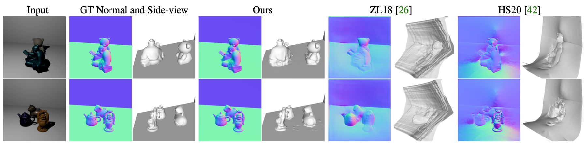

# Neural Reflectance Field from Shading and Shadow under a Fixed Viewpoint
<p align="center">
    
</p>

## Overview

This Github repository stores the code for reproducing the experiments in "Neural Reflectance Field from Shading and Shadow under a Fixed Viewpoint". 
At this time, we release the data of [all real scenes](https://github.com/neuralps3d/neuralps3d/releases/download/v0.1/real_scene.zip) and [one synthetic scene](https://github.com/neuralps3d/neuralps3d/tree/main/dataset/bunny), as well as the demo evaluation code.
The full code and datasets will be released as soon as possible. Please stay tuned!

## Abstract
In this paper, we address the "dual problem" of multi-view scene reconstruction in which we utilize single-view images captured under different point lights to learn a neural scene representation. Different from existing single-view methods which can only recover a 2.5D scene representation (i.e., a normal / depth map for the visible surface), our method learns a neural reflectance field to represent the 3D geometry and BRDFs of a scene. Instead of relying on multi-view photo-consistency, our method exploits two information-rich monocular cues, namely shading and shadow, to infer scene geometry. Experiments on multiple challenging datasets show that our method is capable of recovering 3D geometry, including both visible and invisible parts, of a scene from single-view images. Thanks to the neural reflectance field representation, our method is robust to depth discontinuities. It supports applications like novel-view synthesis and relighting. Our code and model will be made publicly available.  

## Method
<p align="center">
    
</p>

## Results
<p align="center">
    
<b>Results on the synthetic data.</b>
</p>

<p align="center">
    
<b>Results on the real captured data.</b>
</p>

## Datasets Download
- [The Real Scenes](https://github.com/neuralps3d/neuralps3d/releases/download/v0.1/real_scene.zip)
- [The Synthetic Bunny Scene](https://github.com/neuralps3d/neuralps3d/tree/main/dataset/bunny)

## Setup
This method is implemented in PyTorch and tested with Ubuntu 18.04/20.04.

- Python 3.9
- PyTorch 1.80

Please create an anaconda environment called `ps3d` to run this code.
```
conda env create -f environment.yaml
conda activate ps3d
```

## Testing
At this time, we provide the evaluation code for rendering the reconstructed synthetic [`BUNNY`](https://github.com/neuralps3d/neuralps3d/tree/main/dataset/bunny) scene.
```bash
python demo.py --gpu GPU_ID
# Please modify `--chunk **` according to your GPU memory
```

## Training
The training code will be released once ready.

## Acknowledgement
Part of the code is based on the awesome [UNISURF](https://github.com/autonomousvision/unisurf).
